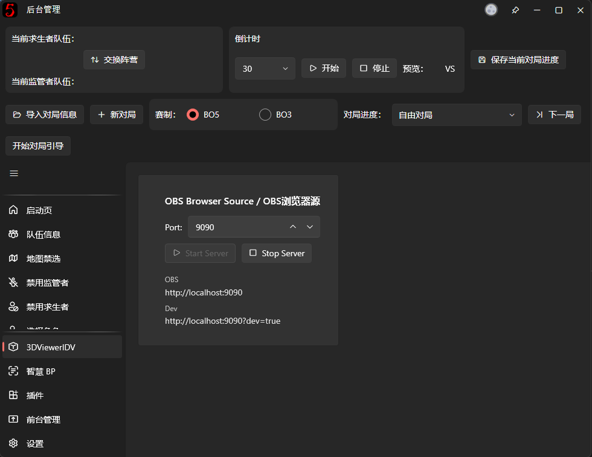

# IDV 3D graphics customization

[简体中文](README_CN.md)
This project is a plugin for [neo-bpsys-wpf](https://github.com/PLFJY/neo-bpsys-wpf) to support 3D graphics. Scenes can be edited with Blender. Read below for instructions.

**!! This project is new and only tested on my own PC and full of bugs, feel free to give feedback (discord: dostojefsky)**


## Setup

1. Install [neo-bpsys-wpf](https://github.com/PLFJY/neo-bpsys-wpf/releases/tag/v2.1.0-beta%2B1e61260)
2. Clone this repository (or download as zip and extract):
   ```
   git clone git@github.com:jefcrb/3DViewerIDV.git
   ```
3. Move project to `%APPDATA%\neo-bpsys-wpf\Plugins`:
   ```
   mv 3DViewerIDV %APPDATA%\neo-bpsys-wpf\Plugins
   ```

## Quick Start

1. Download Blender 3.0+ from https://www.blender.org/download/
2. Open `template.blend` in Blender (File > Open)
3. Edit lighting, camera, or environment as needed
4. Export as GLB (File > Export > glTF 2.0)
5. Copy `scene.glb` to `wwwroot/assets/`

## Template

The `template.blend` file contains:

- **5 Dummy Models**
  - `_HUNTER` - Back center position
  - `_SURVIVOR_1` - Front left
  - `_SURVIVOR_2` - Front center-left
  - `_SURVIVOR_3` - Front center-right
  - `_SURVIVOR_4` - Front right

## Exporting Your Scene

### Export Steps

1. **File > Export > glTF 2.0 (.glb)**
2. **File name**: `scene.glb`
3. **CRITICAL SETTINGS** (right panel):

#### Must Check These:
- **Format**: glTF Binary (.glb)
- **Include > Cameras**
- **Include > Punctual Lights**
- **Transform > +Y Up**
- **Geometry > Apply Modifiers**
- **Geometry > UVs**
- **Geometry > Normals**
- **Materials**: Export

#### Optional:
- **Compression**: Enables for smaller file size
- **Remember Export Settings**: Saves settings for next time

4. **Click "Export glTF 2.0"**

### Copy to Project

Copy the exported file to:
```
%APPDATA%\neo-bpsys-wpf\Plugins\3DViewerIDV\wwwroot\assets
```
as scene.glb

## Settings
After installing the plugin, 3DViewerIDV settings page can be found. From here you can host a web browser source for OBS.

Access the dev page at `http://localhost:{port}?dev=true` to find additional settings

