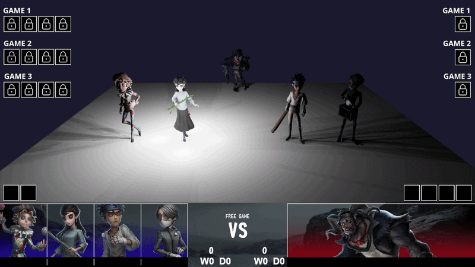

# IDV 3D graphics customization

非专业翻译，仅供参考，请以英文原版为准。（译注）
[英文原版English](README.md)

本项目是[neo-bpsys-wpf](https://github.com/PLFJY/neo-bpsys-wpf)的插件，用于支持3D图形。场景可以使用Blender编辑。请查看下面的说明。

**!! 本项目仅在作者电脑上测试，bug较多，欢迎提供反馈 (discord: dostojefsky)**


## 安装

1. 安装 [neo-bpsys-wpf](https://github.com/PLFJY/neo-bpsys-wpf/releases/tag/v2.1.0-beta%2B1e61260)
2. 克隆本仓库：
   ```
   git clone git@github.com:jefcrb/3DViewerIDV.git
   ```
3. 将项目文件夹移至 `%APPDATA%\neo-bpsys-wpf\Plugins`:
   ```
   mv 3DViewerIDV %APPDATA%\neo-bpsys-wpf\Plugins
   ```

## 快速开始

1. 从 https://www.blender.org/download/ 下载 Blender 3.0 以上版本
2. 在 Blender 中打开 `template.blend` （文件>打开）
3. 根据需要调整场景、光照和相机
4. 导出为 GLB 文件 (文件 > 导出 > glTF 2.0)
5. 将 `scene.glb` 复制到 `wwwroot/assets/`

## 模板

文件 `template.blend` 包含：

- **5个假人模型**
  - `_HUNTER` - 中间靠后
  - `_SURVIVOR_1` - 左前
  - `_SURVIVOR_2` - 左前靠中间
  - `_SURVIVOR_3` - 右前靠中间
  - `_SURVIVOR_4` - 右前

## 导出场景

### 导出步骤

1. **文件 > 导出 > glTF 2.0 (.glb)**
2. **文件名**: `scene.glb`
3. **关键设置** （右侧面板）:

#### 请检查以下几点：
- **格式**: glTF Binary (.glb)
- **包括 > 摄像机**
- **包括 > 精确灯光**
- **变换 > +Y 向上**
- **数据 > 网络 > 应用修改器**
- **数据 > 网络 > UV**
- **数据 > 网络 > 法向**
- **材质**: 导出
译者使用 Blender 5.0.1，部分选项与原文不同，如有问题请参考原文（译注）

#### 可选:
- **压缩**: 可减小文件大小
- **记住导出设置**: 为下次使用保存设置
4. **点击 "导出 glTF 2.0"**

### 复制到项目
将导出的文件复制到以下路径并重命名为`scene.glb`：
```
%APPDATA%\neo-bpsys-wpf\Plugins\3DViewerIDV\wwwroot\assets
```

## 参考资源
- **Blender 文档**: https://docs.blender.org/
- **glTF 导出指南**: https://docs.blender.org/manual/en/latest/addons/import_export/scene_gltf2.html
- **快速参考**: 详见 BLENDER_EXPORT_CHECKLIST.md
