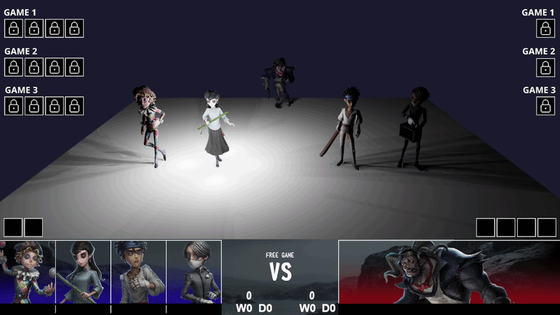
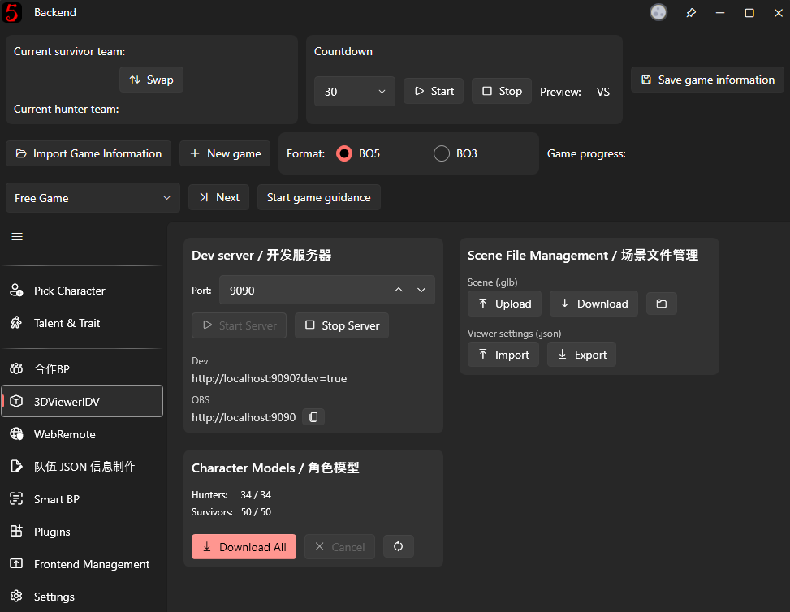
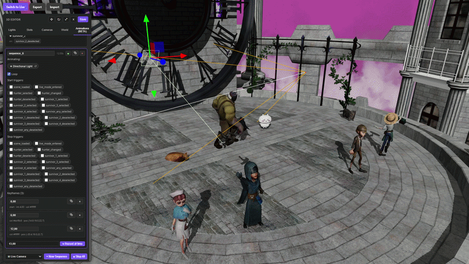

# IDV 3D 图形自定义

非专业翻译，仅供参考，请以英文原版为准。（译注）
[英文原版 English](README.md)

本项目是 [neo-bpsys-wpf](https://github.com/PLFJY/neo-bpsys-wpf) 的插件，提供 3D 图形支持。

**!! 本项目仍处于早期阶段，仅在作者电脑上测试过，bug 较多，欢迎反馈（discord: dostojefsky）**



## 安装

1. 安装 [neo-bpsys-wpf](https://github.com/PLFJY/neo-bpsys-wpf/releases/tag/v2.1.0-beta%2B1e61260)，并通过插件商店安装本插件；或：
2. 克隆本仓库（或下载 zip 并解压）：
   ```
   git clone git@github.com:jefcrb/3DViewerIDV.git
   ```
3. 将项目文件夹移至 `%APPDATA%\neo-bpsys-wpf\Plugins`：
   ```
   mv 3DViewerIDV %APPDATA%\neo-bpsys-wpf\Plugins
   ```

   

## 快速开始


1. 上传你自己的 .glb 场景，或使用内置场景；可使用 Blender 或 [threejs editor](https://threejs.org/editor/) 等 3D 软件进行编辑
2. 下载角色模型
3. 启动开发服务器，在浏览器中打开 http://localhost:9090?dev=true
4. 自由编辑组件、添加角色、创建动画
5. 预览你的作品
6. 在 OBS 中将 OBS URL 配置为浏览器源


## 功能

在开发面板中自定义灯光、相机位置、渲染设置等。
基于各种触发器创建关键帧动画，控制灯光或相机的移动。


